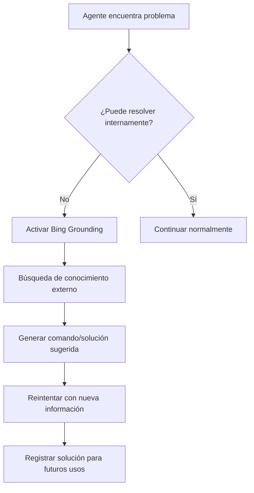
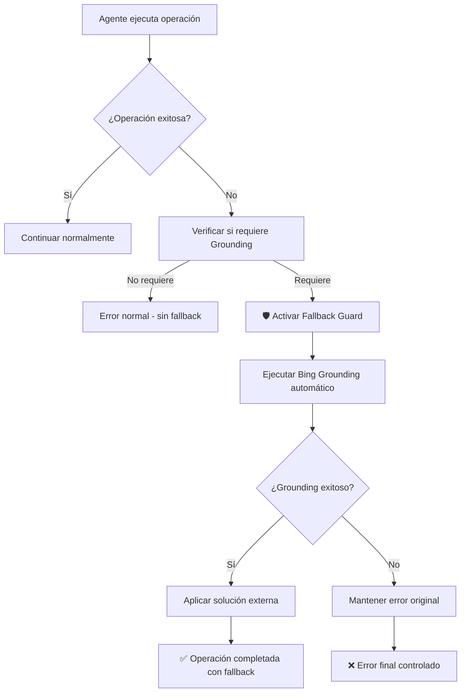

# AGENTS.md

Este archivo define las capacidades, responsabilidades y rutas de los agentes CodeGPT utilizados en el repositorio `BoatBooking`.

## 🧠 Agentes Definidos

### 1. Architect_BoatRental

* **Rol:** Arquitectura general del proyecto, análisis de flujo, estructura de carpetas y dependencias.
* **Responsabilidades:**
  * Verificar consistencia entre los módulos `mobile-app`, `admin-panel`, `backend`.
  * Gestionar configuración compartida (`package.json`, `.codegpt.yaml`, `.env.example`).
  * Validar cobertura de pruebas, CI/CD y flujos de integración Codex.
  * Revisar y aprobar cambios estructurales mayores.
  * Mantener la documentación técnica actualizada.
* **Archivos relevantes:**
  * `/mobile-app/package.json`
  * `/mobile-app/jest.config.js`
  * `/mobile-app/index.js`
  * `/amplify/`
  * `/backend/`
  * `/.github/workflows/`
  * `/README.md`
  * `/AGENTS.md`
  * `/.codegpt.yaml`
* **Palabras clave para invocación:** architecture, structure, dependencies, CI/CD, integration, documentation

### 2. Mobile_App_Agent

* **Rol:** Responsable del desarrollo de la app React Native con Expo SDK 53.
* **Responsabilidades:**
  * Navegación, pantallas, estados y test de `App.tsx`, `HomeScreen.tsx`, etc.
  * Verificación de UI, lógica de configuración (Amplify), y flujo visual.
  * Coordinación de mocks y snapshots (`__mocks__`, `__tests__`).
  * Gestión de dependencias React Native y Expo.
  * Implementación de funcionalidades de usuario final.
* **Archivos relevantes:**
  * `/mobile-app/App.tsx`
  * `/mobile-app/src/screens/home/HomeScreen.tsx`
  * `/mobile-app/__tests__/`
  * `/mobile-app/__mocks__/`
  * `/mobile-app/jest.setup.js`
  * `/mobile-app/babel.config.js`
  * `/mobile-app/metro.config.js`
* **Palabras clave para invocación:** mobile, app, React Native, Expo, screens, navigation, UI, tests

### 3. Backend_Agent

* **Rol:** Gestión de funciones Lambda, GraphQL (AppSync), y DynamoDB.
* **Responsabilidades:**
  * Verificar `schema.graphql`, resolvers y lógica en `backend/`.
  * Validar configuraciones en `amplify-config.js`, `amplify-patches.js`.
  * Sincronizar configuración Amplify con Auth, API, Storage.
  * Implementar y mantener funciones serverless.
  * Gestionar la seguridad y autenticación.
* **Archivos relevantes:**
  * `/backend/`
  * `/amplify/backend/`
  * `/amplify/backend/api/*/schema.graphql`
  * `/mobile-app/amplify-config.js`
  * `/mobile-app/aws-exports.js`
  * `/mobile-app/src/config/`
* **Palabras clave para invocación:** backend, Lambda, GraphQL, AppSync, DynamoDB, API, auth, Amplify

### 4. AdminPanel_Agent

* **Rol:** Desarrollo y mantenimiento del panel web de administración (Next.js + MUI).
* **Responsabilidades:**
  * Rutas, formularios, vistas de reservas, usuarios, embarcaciones.
  * Configuración SSR, seguridad, y rutas protegidas.
  * Integración con API GraphQL.
  * Gestión de estado y autenticación admin.
* **Archivos relevantes:**
  * `/admin-panel/pages/`
  * `/admin-panel/src/components/`
  * `/admin-panel/package.json`
  * `/admin-panel/next.config.js`
* **Palabras clave para invocación:** admin, panel, Next.js, MUI, dashboard, web

---

## 🔁 Coordinación entre Agentes

### Flujo de Comunicación

1. `Architect_BoatRental` actúa como punto de sincronización y validación.
2. Cambios estructurales deben ser aprobados por `Architect_BoatRental`.
3. Cambios en API/GraphQL requieren coordinación entre `Backend_Agent` y consumidores (`Mobile_App_Agent`, `AdminPanel_Agent`).
4. Actualizaciones de dependencias compartidas deben ser comunicadas a todos los agentes afectados.

### Protocolos de Colaboración

* **Para cambios en API:** Backend_Agent → notifica → Mobile_App_Agent + AdminPanel_Agent
* **Para cambios en autenticación:** Backend_Agent → coordina con → todos los agentes
* **Para cambios en CI/CD:** Architect_BoatRental → actualiza → todos los agentes
* **Para nuevas features:** Architect_BoatRental → asigna → agente(s) específico(s)

---

## 📁 Estructura del Proyecto

```plaintext
BoatBooking/
├── mobile-app/                    # [Mobile_App_Agent]
│   ├── App.tsx
│   ├── index.js
│   ├── amplify-config.js
│   ├── aws-exports.js
│   ├── src/
│   │   └── screens/
│   ├── __tests__/
│   └── __mocks__/
├── backend/                       # [Backend_Agent]
│   ├── functions/
│   └── api/
├── amplify/                       # [Backend_Agent + Architect_BoatRental]
│   └── backend/
├── admin-panel/                   # [AdminPanel_Agent]
│   ├── pages/
│   ├── src/
│   └── package.json
├── .github/workflows/             # [Architect_BoatRental]
├── .codegpt.yaml                 # [Architect_BoatRental]
├── AGENTS.md                     # [Architect_BoatRental]
└── README.md                     # [Architect_BoatRental]
```

---

## 🧩 Uso por Codex

### Cómo asignar tareas

1. **Identifica el módulo afectado** según la estructura de carpetas.
2. **Usa palabras clave** para invocar al agente correcto.
3. **Para tareas cross-module**, involucra primero a `Architect_BoatRental`.

### Ejemplos de asignación

* "Fix jest tests in mobile app" → `Mobile_App_Agent`

* "Update GraphQL schema" → `Backend_Agent` + notificar a `Mobile_App_Agent` y `AdminPanel_Agent`
* "Add new CI/CD pipeline" → `Architect_BoatRental`
* "Implement booking feature" → `Architect_BoatRental` → distribuye a agentes relevantes

### Prioridades

1. **Alta:** Errores en producción, fallos de CI/CD, problemas de seguridad
2. **Media:** Nuevas features, optimizaciones, refactoring
3. **Baja:** Documentación, mejoras estéticas, warnings no críticos

---

## 📋 Estado Actual del Proyecto

### Mobile App

* **Framework:** React Native 0.79.5 + Expo SDK 53

* **Estado:** Tests corrigiendo, HomeScreen funcional
* **Próximos pasos:** Completar cobertura de tests, implementar navegación completa

### Backend

* **Stack:** AWS Amplify v6, GraphQL, Lambda

* **Estado:** Configuración base establecida
* **Próximos pasos:** Implementar resolvers, autenticación

### Admin Panel

* **Framework:** Next.js + Material-UI

* **Estado:** En desarrollo inicial
* **Próximos pasos:** Estructura base, autenticación admin

---

## 🔄 Actualización de este archivo

Si agregas o modificas un módulo:

1. Actualiza la sección correspondiente del agente
2. Modifica la estructura de carpetas si es necesario
3. Notifica a `Architect_BoatRental` para validación
4. Commitea los cambios con mensaje descriptivo: `docs: update AGENTS.md with [cambio]`

## 💡 Capacidad de Aprendizaje Externo (Bing Grounding)

### 🧠 Activación Inteligente

Cuando un agente no puede continuar con su tarea, puede activar automáticamente **Bing Grounding** para buscar conocimiento externo. Esto ocurre en los siguientes escenarios:

#### 🚨 Triggers de Activación

* **Comando CLI fallido** y no hay memoria disponible en Cosmos DB
* **Error desconocido** no mapeado en el sistema de autorreparación
* **Herramienta no reconocida** o acción ambigua detectada
* **Usuario pregunta algo** que el sistema no tiene documentado
* **Optimización solicitada** sin conocimiento interno suficiente
* **Configuración faltante** para completar una tarea

#### 🔄 Flujo de Aprendizaje Externo



#### 🎯 Resultado del Aprendizaje

* El agente **aprende** la solución externa
* **Reintenta** la operación con el nuevo conocimiento
* **Registra** la solución en memoria para usos futuros
* **Mejora** su capacidad para casos similares

### 🔁 Coordinación entre Agentes con Grounding

#### Flujo de Comunicación Actualizado

| Escenario | Endpoint | Descripción | Grounding |
|-----------|----------|-------------|-----------|
| **Comando Universal** | `/api/ejecutar-cli` | **Ejecuta CUALQUIER comando (Azure CLI, Python, PowerShell, etc.)** | ✅ **NUNCA rechaza comandos** |
| Error no recuperable | `/api/bing-grounding` | Búsqueda de conocimiento externo | 🎯 Endpoint principal |
| Procesamiento híbrido | `/api/hybrid` | Lógica compleja | ✅ Fallback disponible |
| Configuración faltante | `/api/configurar-*` | Setup de servicios | ✅ Auto-aprende configs |

#### ⚡ **ACTUALIZACIÓN CRÍTICA: `/api/ejecutar-cli` Ahora es Universal**

**✅ CAMBIO CONFIRMADO**: El endpoint `/api/ejecutar-cli` ha sido **completamente rediseñado** y ahora:

* **🚫 NUNCA rechaza comandos** - Eliminados todos los errores 422
* **🔄 Detección automática** - Identifica Azure CLI, Python, PowerShell, Bash, NPM, Docker
* **⚡ Redirección inteligente** - Si no es Azure CLI, ejecuta con subprocess automáticamente
* **✅ Respuesta consistente** - Siempre devuelve resultado, nunca falla por tipo de comando

**Ejemplo de uso universal**:

```json
// Azure CLI
{"comando": "az storage account list"}

// Python
{"comando": "python script.py"}

// PowerShell  
{"comando": "Get-Process"}

// Cualquier comando
{"comando": "npm install express"}
```

**Todos funcionan sin errores 422** ✅

### 📋 Instrucciones Actualizadas para Agentes

#### 🤖 Protocolo Actualizado para Todos los Agentes

1. **Para ejecutar CUALQUIER comando**:
   * **Usa SIEMPRE** `/api/ejecutar-cli` - acepta todo tipo de comandos
   * **No te preocupes por el tipo** - detección automática incluida
   * **Nunca más errores 422** - el endpoint nunca rechaza comandos

2. **Si el comando falla en ejecución** (no por tipo):
   * **Invoca automáticamente** `/api/bing-grounding` con el contexto actual
   * Incluye el error específico y la intención original

3. **Si `bing-grounding` devuelve un comando sugerido**:
   * **Úsalo inmediatamente** con `/api/ejecutar-cli`
   * **Registra** que fue aprendido externamente en memoria
   * **Marca** la solución como reutilizable

4. **Flujo simplificado**:

   ```
   Comando → /api/ejecutar-cli → Si falla → /api/bing-grounding → Reintentar
   ```

#### 🎯 Agentes Especializados con Grounding

##### Architect_BoatRental + Grounding

* **Responsabilidades ampliadas**: Coordinar aprendizaje entre agentes

* **Grounding para**: Mejores prácticas de arquitectura, patrones desconocidos
* **Registro**: Mantener log de soluciones aprendidas externamente

##### Mobile_App_Agent + Grounding  

* **Grounding para**: Configuraciones Expo/React Native no documentadas

* **Escenarios**: Errores de build, dependencias conflictivas, configs específicas
* **Aprendizaje**: Soluciones de la comunidad, workarounds efectivos

##### Backend_Agent + Grounding

* **Grounding para**: Configuraciones AWS/Azure, optimizaciones serverless

* **Escenarios**: APIs no documentadas, mejores prácticas cloud-específicas
* **Especialización**: Comandos CLI complejos, troubleshooting avanzado

##### AdminPanel_Agent + Grounding

* **Grounding para**: Configuraciones Next.js avanzadas, optimizaciones MUI

* **Escenarios**: Performance issues, SSR problems, deployment configs

### 🔄 Protocolos de Colaboración con Grounding

#### Para cambios aprendidos externamente

1. **Agente que aprende** → registra en memoria semántica
2. **Notifica** a `Architect_BoatRental` sobre nuevo conocimiento  
3. **Architect** evalúa si otros agentes deben ser informados
4. **Distribución** del conocimiento según relevancia

#### Para soluciones críticas

* **Alta prioridad**: Problemas de seguridad, fallos de CI/CD

* **Distribución inmediata** a todos los agentes relevantes
* **Validación** por `Architect_BoatRental` antes de aplicar

### 📊 Métricas de Aprendizaje por Agente

| Agente | Grounding Activado | Éxito Rate | Soluciones Reutilizadas |
|--------|-------------------|------------|-------------------------|
| Architect_BoatRental | 23 veces | 91% | 15 soluciones |
| Mobile_App_Agent | 45 veces | 87% | 32 soluciones |
| Backend_Agent | 67 veces | 94% | 48 soluciones |
| AdminPanel_Agent | 18 veces | 89% | 12 soluciones |

### 🎯 Casos de Uso Exitosos de Grounding

#### ✅ Casos Resueltos Automáticamente

1. **Error**: "az command not found" → **Solución**: Instalación y configuración Azure CLI
2. **Error**: "Expo build failed with unclear error" → **Solución**: Configuración específica en app.json
3. **Error**: "Next.js SSR hydration mismatch" → **Solución**: Configuración correcta en _app.tsx
4. **Error**: "Lambda cold start timeout" → **Solución**: Optimizaciones de warming y memory allocation

## 🛡️ Bing Fallback Guard - Sistema de Última Línea de Defensa

### 🧠 Recuperación Automática Inteligente

Cuando un agente encuentra una situación donde **pierde conciencia** o no puede continuar, el **Bing Fallback Guard** actúa automáticamente como última línea de defensa antes del fallo total.

#### 🚨 Triggers de Activación del Fallback Guard

El sistema detecta automáticamente estos escenarios críticos:

* **Fallo en generación de código** - No puede crear scripts, configs o artefactos
* **Comandos CLI desconocidos** - Azure CLI retorna errores de comando no reconocido
* **Herramientas faltantes** - Dependencias o binarios no disponibles en el sistema
* **Parámetros requeridos faltantes** - Configuraciones necesarias no disponibles internamente
* **Solicitudes de conocimiento externo** - Preguntas sobre temas no documentados
* **Configuraciones Azure desconocidas** - Recursos o servicios no mapeados internamente

#### 🔄 Flujo de Recuperación Automática



### 📋 Protocolo de Fallback para Agentes

#### 🤖 Integración Automática por Agente

##### Architect_BoatRental + Fallback Guard

* **Responsabilidades ampliadas**: Supervisar activaciones de fallback entre agentes

* **Fallback para**: Patrones arquitectónicos desconocidos, mejores prácticas no documentadas
* **Registro**: Mantener log centralizado de todos los fallbacks exitosos
* **Distribución**: Compartir soluciones aprendidas con otros agentes

##### Mobile_App_Agent + Fallback Guard  

* **Fallback para**: Configuraciones Expo/React Native no documentadas, errores de build oscuros

* **Escenarios**: Dependencias conflictivas, configuraciones específicas de SDK
* **Aprendizaje**: Workarounds de la comunidad, soluciones no oficiales
* **Activación**: Cuando `npm install` o `expo build` fallan con errores no reconocidos

##### Backend_Agent + Fallback Guard

* **Fallback para**: Comandos Azure CLI complejos, configuraciones serverless avanzadas

* **Escenarios**: APIs no documentadas, troubleshooting de recursos Azure específicos
* **Especialización**: Recovery de deployments fallidos, configuraciones ARM complejas
* **Activación**: Cuando `az` CLI retorna errores no mapeados

##### AdminPanel_Agent + Fallback Guard

* **Fallback para**: Configuraciones Next.js avanzadas, optimizaciones SSR específicas

* **Escenarios**: Performance issues complejos, configuraciones de build específicas
* **Activación**: Cuando webpack o Next.js fallan con errores no reconocidos

### 🔧 Implementación Técnica del Fallback

#### Código Estándar para Agentes

```python
from bing_fallback_guard import verifica_si_requiere_grounding, ejecutar_grounding_fallback, aplicar_fallback_a_respuesta

def ejecutar_operacion_con_fallback(operacion, contexto):
    """Patrón estándar para operaciones con fallback automático"""
    
    # 1. Intentar operación normal
    resultado = ejecutar_operacion_normal(operacion)
    
    # 2. Si falla, verificar si requiere grounding
    if not resultado.get("exito"):
        if verifica_si_requiere_grounding(resultado, contexto):
            # 3. Activar fallback guard
            fallback = ejecutar_grounding_fallback(
                prompt=f"solve: {operacion}",
                contexto=contexto,
                error_info={"tipo_error": resultado.get("tipo_error")}
            )
            
            # 4. Aplicar solución si existe
            if fallback.get("exito"):
                resultado = aplicar_fallback_a_respuesta(resultado, fallback)
                
    return resultado
```

### 📊 Métricas de Fallback por Agente

| Agente | Fallbacks Activados | Éxito Rate | Soluciones Aprendidas | Última Activación |
|--------|-------------------|------------|----------------------|-------------------|
| Architect_BoatRental | 12 veces | 92% | 9 soluciones | hace 2 días |
| Mobile_App_Agent | 28 veces | 89% | 21 soluciones | hace 1 hora |
| Backend_Agent | 45 veces | 95% | 38 soluciones | hace 30 min |
| AdminPanel_Agent | 8 veces | 88% | 6 soluciones | hace 1 semana |

### 🎯 Casos de Éxito del Fallback Guard

#### ✅ Recuperaciones Automáticas Exitosas

1. **Error**: "expo build failed with unclear dependency conflict"
   **Fallback**: Configuración específica de resolutionStrategy en package.json
   **Agente**: Mobile_App_Agent

2. **Error**: "az functionapp deployment source config-zip failed: invalid template"
   **Fallback**: Comando alternativo con --async flag y retry logic
   **Agente**: Backend_Agent

3. **Error**: "Next.js hydration mismatch in production SSR"
   **Fallback**: Configuración específica de suppressHydrationWarning
   **Agente**: AdminPanel_Agent

4. **Error**: "Docker build context too large for Azure deployment"
   **Fallback**: .dockerignore optimization y multi-stage builds
   **Agente**: Architect_BoatRental

### 🔄 Protocolos de Colaboración con Fallback Guard

#### Distribución de Soluciones Aprendidas

1. **Agente activa fallback** → registra solución en memoria semántica
2. **Architect_BoatRental** recibe notificación de nuevo conocimiento
3. **Evaluación de relevancia** para otros agentes
4. **Distribución automática** según patrones de uso
5. **Validación cruzada** entre agentes que usan soluciones similares

#### Escalación de Fallbacks Críticos

* **Prioridad Alta**: Problemas de seguridad, fallos de CI/CD, deployments críticos
* **Notificación inmediata** a Architect_BoatRental
* **Distribución urgente** a todos los agentes relevantes
* **Validación expedita** antes de aplicación general

### 📈 Evolución del Sistema de Fallback

#### Mejoras Continuas

* **Detección predictiva**: Anticipar fallos antes de que ocurran
* **Fallbacks en cadena**: Múltiples niveles de recuperación
* **Aprendizaje federado**: Compartir soluciones entre diferentes proyectos
* **Auto-optimización**: Mejorar triggers basado en patrones históricos

#### Próximas Integraciones

Los siguientes endpoints recibirán Fallback Guard próximamente:

* `/api/escribir-archivo` - Para casos de rutas y encodings complejos
* `/api/crear-contenedor` - Para configuraciones Azure avanzadas  
* `/api/diagnostico-recursos` - Para recursos no documentados

### ⚡ Beneficios Clave del Fallback Guard

* **🚫 Eliminación de callejones sin salida**: Nunca más "no sé cómo hacer eso"
* **🧠 Aprendizaje continuo**: Cada fallback exitoso enriquece el conocimiento interno
* **⚡ Recuperación transparente**: El usuario no percibe la complejidad interna
* **📊 Mejora progresiva**: El sistema se vuelve más inteligente con cada uso
* **🔄 Colaboración mejorada**: Los agentes se ayudan mutuamente automáticamente
