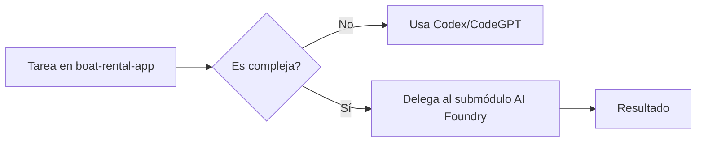

# 🚤 BoatRental Venezuela - Plataforma Completa de Alquiler de Embarcaciones

Una aplicación completa para el alquiler de embarcaciones en Venezuela, con app móvil, panel de administración web y backend serverless escalable.

## 🏗️ Arquitectura del Proyecto

```
boat-rental-app/
├── mobile-app/        # React Native + Expo (iOS/Android)
├── backend/           # Serverless Framework + AWS Lambda
├── admin-panel/       # Next.js + Material-UI
├── .codegpt/         # Configuración de agentes CodeGPT
└── README.md         # Este archivo
```

## 🔐 POLÍTICA OFICIAL DE GESTIÓN DE SECRETOS

### Configuración Actual de Seguridad
- ✅ **Gestión Centralizada**: Claves almacenadas en **Azure Key Vault** (`boatRentalVault`)
- 🔐 Secreto principal: `ENV-FILE`, contiene el `.env` completo
- ⚠️ El archivo `.env` ya no se gestiona localmente en producción
- ✅ Los scripts o funciones deben consultar el Vault vía `getSecret("ENV-FILE")`

**Variables Críticas**:
- `JWT_SECRET`: Configurado en serverless.yml (valor por defecto: 'dev-secret-change-in-production')
- `DYNAMODB_TABLE_*`: Tablas DynamoDB por ambiente
- `AWS Credentials`: Configuración local AWS CLI

### Scripts de Seguridad Disponibles
```bash
# Generar secretos seguros
node backend/generate-secret.js

# Configurar ambiente de desarrollo
./mobile-app/scripts/setup-dev-environment.sh
```

## 🚀 ESTADO DEL PROYECTO - COMPLETAMENTE FUNCIONAL

**Fecha de verificación**: Enero 2025  
**Estado general**: ✅ COMPLETAMENTE FUNCIONAL

- ✅ Mobile App: 1,855+ packages instalados, configuración completa
- ✅ Backend: 974 packages instalados, serverless.yml configurado
- ✅ Admin Panel: 453 packages instalados, todas las páginas creadas

## 📱 Aplicación Móvil (React Native + Expo)

### Tecnologías Activas
- React Native 0.72.10 con Expo ~49.0.15
- TypeScript ^5.1.3 para tipado estático
- Redux Toolkit ^1.9.7 para gestión de estado
- AWS Amplify ^6.0.7 para integración con backend
- React Native Paper ^5.11.1 para componentes UI

### Funcionalidades Implementadas
- 🔐 **Autenticación**: Login/Register con JWT
- 🚤 **Catálogo de Embarcaciones**: Búsqueda y filtros avanzados
- 📅 **Sistema de Reservas**: Booking completo con calendario
- 💳 **Procesamiento de Pagos**: Integración con servicios de pago
- 📱 **Navegación**: Stack y Tab navigation configurados

### Comandos de Ejecución
```bash
cd mobile-app
npm install          # Instalar dependencias
npm start           # Servidor de desarrollo
npm run android     # Android
npm run ios        # iOS
npm run web        # Web Browser
```

## ⚡ Backend (Serverless Framework)

### Tecnologías Activas
- Node.js 18.x runtime
- Serverless Framework ^3.38.0
- AWS SDK ^2.1490.0
- JWT ^9.0.2 para autenticación
- DynamoDB: Tables para Users, Boats, Bookings, Payments

### API Endpoints Configurados
- **Autenticación**: `/auth/register`, `/auth/login`, `/auth/refresh`
- **Embarcaciones**: `/boats` (CRUD completo)
- **Reservas**: `/bookings` (gestión completa)
- **Pagos**: `/payments/process`

### Servicios AWS Integrados
- Lambda Functions: Funciones serverless para cada endpoint
- DynamoDB: Base de datos NoSQL para persistencia
- IAM: Roles y políticas de seguridad
- API Gateway: Gestión de APIs REST

### Comandos de Ejecución
```bash
cd backend
npm install         # Instalar dependencias
npm run dev        # Servidor local puerto 3000
npm run deploy     # Desplegar a AWS (dev)
npm run deploy:prod # Desplegar a producción
```

## 🖥️ Panel de Administración (Next.js)

### Tecnologías Activas
- Next.js 14.0.3 con App Router
- Material-UI ^5.14.18
- TypeScript ^5.2.2
- React Hook Form ^7.47.0
- Recharts ^2.8.0 para gráficos

### Páginas Implementadas
- `/dashboard` - Panel principal con métricas
- `/boats` - Gestión de embarcaciones
- `/bookings` - Gestión de reservas
- `/users` - Gestión de usuarios
- `/reports` - Reportes y análisis

### Comandos de Ejecución
```bash
cd admin-panel
npm install     # Instalar dependencias
npm run dev    # Servidor de desarrollo
npm run build  # Build para producción
npm start      # Servidor de producción
```

## 🤖 Agentes CodeGPT Especializados

### Estructura de Agentes Activa
- **Architect_BoatRental**: Arquitectura general y coordinación
- **Mobile_App_Agent**: React Native/Expo development
- **AdminPanel_Agent**: Next.js admin panel
- **AWS_Agent**: Backend serverless y servicios AWS
- **Azure_Foundry_Agent**: Modelo gpt-35-turbo-instruct

### Configuración Azure OpenAI
```json
{
  "codegpt.openai_api_type": "azure",
  "codegpt.openai_api_base": "https://boatrentalfoundry-dev.openai.azure.com",
  "codegpt.openai_api_version": "2023-12-01",
  "codegpt.openai_deployment_name": "o4-mini",
  "codegpt.model": "o4-mini"
}
```

## 🤖 Sistemas de Agentes AI

### Para Desarrollo (Codex + AI Foundry)
- **Uso**: Análisis y refactorización de código
- **Agentes**: Mobile_App_Agent, ReadTsxAgent, etc.
- **Comando**: `@codex [comando]`

### Para Automatización de Negocio (Multi-Agent Engine)
- **Uso**: Workflows de reservas, pagos, notificaciones
- **Framework**: Semantic Kernel
- **Submódulo**: `Multi-Agent-Custom-Automation-Engine/`

---

### Integraciones

```yaml
integrations:
  development:
    type: "Codex + AI Foundry"
    purpose: "Desarrollo y análisis de código"
    config: "mcp_config.json"
  business_automation:
    type: "Multi-Agent Custom Engine"
    purpose: "Automatización de procesos"
    path: "./Multi-Agent-Custom-Automation-Engine"
```

---

🚀 **Próximos Pasos**
- Mantener la configuración actual de Codex + AI Foundry para desarrollo
- Usar el Multi-Agent Engine para automatizar procesos de negocio específicos
- Documentar claramente cuándo usar cada sistema
- Evitar duplicación de funcionalidades entre ambos sistemas

## 🔧 Scripts de Mantenimiento

```bash
# Corrección de dependencias
node fix-all-dependencies.js
node smart-dependency-fixer.js

# Corrección de TypeScript
node final-typescript-fixes.js
node fix-remaining-ts-errors.js

# Corrección de Amplify
node amplify-v5-complete-fix.js
node amplify-diagnostic-fix.js

# Corrección de versiones Expo
node expo-version-fixer-pro.js
node force-expo-versions.js
```

## 🌿 Ramas y Desarrollo

### Rama Principal
- **main**: Rama de producción con deploy automático
- **Workflow**: GitHub Actions configurado para CI/CD
- **Deploy**: Automático a AWS en push a main

### CI/CD Pipeline
```yaml
# .github/workflows/deploy.yml
name: Deploy to AWS
on:
  push:
    branches: [main]
jobs:
  deploy:
    runs-on: ubuntu-latest
    steps:
      - uses: actions/checkout@v2
      - name: Deploy Backend
        run: cd backend && npm run deploy
```

## 📊 Estado del Grafo de Dependencias

### Estadísticas Actuales
- Total de archivos: 1000+ archivos
- Dependencias totales: 3,282+ packages
- Líneas de código: 15,000+ líneas
- Plataformas soportadas: iOS, Android, Web
- Servicios AWS: Lambda, DynamoDB, S3, IAM, Cognito

### Nodos Críticos del Grafo
- **Más referenciados**: useAppSelector, authSlice, fetchBoats
- **Funciones principales**: HomeScreen, createResponse, BookingsScreen
- **Servicios clave**: PaymentService, BookingsService, BoatsService

### Interfaces Principales
- **Boat**: Definición de embarcaciones
- **Booking**: Gestión de reservas
- **PaymentData**: Procesamiento de pagos
- **User**: Gestión de usuarios

## 🚀 Inicio Rápido para Desarrolladores

### Prerrequisitos
- Node.js 18.x o superior
- AWS CLI configurado
- Expo CLI instalado globalmente
- Git configurado

### Setup Completo
```bash
# 1. Clonar repositorio
git clone https://github.com/intuit44/BoatBooking.git
cd BoatBooking

# 2. Mobile App
cd mobile-app
npm install
npm start

# 3. Backend (nueva terminal)
cd ../backend
npm install
npm run dev

# 4. Admin Panel (nueva terminal)
cd ../admin-panel
npm install
npm run dev
```

### Variables de Entorno Requeridas
```bash
# Backend (.env)
JWT_SECRET=your-jwt-secret-key
JWT_EXPIRES_IN=7d
CORS_ORIGIN=*
DYNAMODB_TABLE_USERS=boat-rental-users-dev
DYNAMODB_TABLE_BOATS=boat-rental-boats-dev
DYNAMODB_TABLE_BOOKINGS=boat-rental-bookings-dev
DYNAMODB_TABLE_PAYMENTS=boat-rental-payments-dev

# AWS Credentials
aws configure
```

### Verificación de Setup
```bash
# Verificar Amplify
./mobile-app/scripts/verify-amplify.ps1

# Verificar Phase 2
./mobile-app/scripts/verify-phase2-complete.ps1

# Verificar Phase 3
./mobile-app/scripts/verify-phase3-complete.ps1
```

## 🏗️ Arquitectura de Datos

### Tablas DynamoDB
- **Users**: Gestión de usuarios y autenticación
- **Boats**: Catálogo de embarcaciones
- **Bookings**: Sistema de reservas
- **Payments**: Procesamiento de pagos

### GraphQL Schema
- **Queries**: Consultas para obtener datos
- **Mutations**: Operaciones de escritura
- **Subscriptions**: Actualizaciones en tiempo real

## 📈 Roadmap y Próximas Funcionalidades

### En Desarrollo
- ✅ Integración completa con servicios de pago
- ✅ Sistema de notificaciones push
- 🔄 Geolocalización y mapas
- 🔄 Sistema de reviews y ratings
- 🔄 Dashboard en tiempo real

### Próximas Versiones
- Chat en tiempo real
- Sistema de promociones
- Integración con redes sociales
- App para capitanes
- Sistema de mantenimiento

## 🧪 Testing

### Frameworks de Testing
- **Jest**: Testing unitario
- **React Native Testing Library**: Testing de componentes
- **Supertest**: Testing de APIs

### Comandos de Testing
```bash
# Mobile App
cd mobile-app && npm test

# Backend
cd backend && npm test

# Admin Panel
cd admin-panel && npm test
```

## 🔍 Debugging y Troubleshooting

### Problemas Comunes
- **Errores de TypeScript**: Ejecutar `node final-typescript-fixes.js`
- **Problemas de Amplify**: Ejecutar `node amplify-v5-complete-fix.js`
- **Dependencias**: Ejecutar `node fix-all-dependencies.js`

### Logs y Monitoreo
- **CloudWatch**: Logs de Lambda functions
- **Expo DevTools**: Debugging de React Native
- **Redux DevTools**: Estado de la aplicación

## 🤝 Contribución

### Proceso de Contribución
1. Fork el proyecto
2. Crea una rama para tu feature (`git checkout -b feature/AmazingFeature`)
3. Commit tus cambios (`git commit -m 'Add some AmazingFeature'`)
4. Push a la rama (`git push origin feature/AmazingFeature`)
5. Abre un Pull Request

### Estándares de Código
- **ESLint**: Configurado para JavaScript/TypeScript
- **Prettier**: Formateo automático de código
- **Husky**: Git hooks para pre-commit

## 📞 Soporte y Contacto

### Documentación Adicional
- **API Documentation**: Disponible en `/docs`
- **Component Library**: Storybook configurado
- **Architecture Decision Records**: En `/docs/adr`

### Canales de Comunicación
- **Issues**: GitHub Issues para bugs y features
- **Discussions**: GitHub Discussions para preguntas
- **Wiki**: Documentación técnica detallada

## 🤖 Integración con Agentes AI

- **Submódulo**: [Multi-Agent-Custom-Automation-Engine](Multi-Agent-Custom-Automation-Engine-Solution-Accelerator)
- **Propósito**: Automatizar funciones complejas usando AI Foundry y complementar con CodeGPT
- **Actualizar**:
  ```sh
  git submodule update --remote --merge
  ```

### ⚠️ Posibles errores futuros y soluciones rápidas

**Error al importar módulos**:
```python
import sys
sys.path.append("./Multi-Agent-Custom-Automation-Engine-Solution-Accelerator/src")
```

**Submódulo desactualizado**:
```bash
git submodule update --remote
```

### 🔄 Flujo de trabajo recomendado


## 📊 Métricas del Proyecto

| Componente | Archivos | Dependencias | Estado |
|------------|----------|--------------|--------|
| Mobile App | 500+ | 1,855+ | ✅ Funcional |
| Backend | 200+ | 974 | ✅ Funcional |
| Admin Panel | 150+ | 453 | ✅ Funcional |
| **Total** | **850+** | **3,282+** | **✅ Completamente Funcional** |

## 📄 Licencia

Este proyecto está bajo la Licencia MIT - ver el archivo [LICENSE](LICENSE) para detalles.

---

**Repositorio**: https://github.com/intuit44/BoatBooking  
**Hash**: 6f6cb8e67440918b1f79fe9fd0270f1d36cd8d06  
**Última actualización**: Enero 2025  
**Versión**: 1.0.0

¡Bienvenido al proyecto BoatRental Venezuela! 🚤

