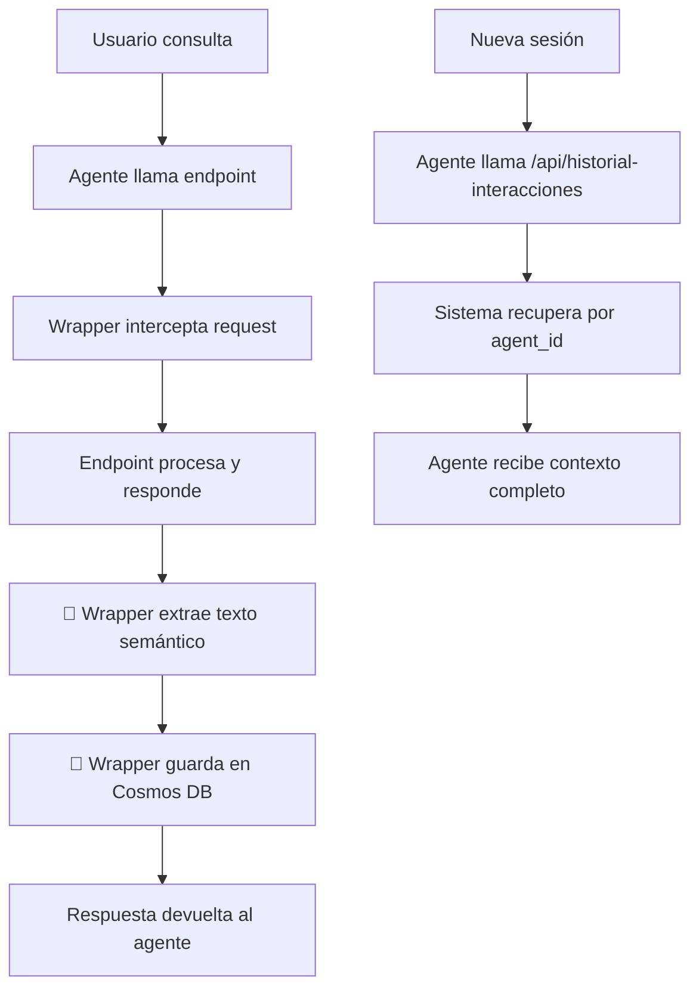

# 🧠 Memoria Global del Agente - Sistema Automático

## 📋 Problema Resuelto

**Antes**: El agente leía archivos pero sus resúmenes NO se guardaban en Cosmos DB. En nuevas sesiones, no recordaba nada.

**Ahora**: Sistema de memoria global **100% automático** que captura TODAS las interacciones sin depender de plataformas externas.

## ✨ Características Clave

✅ **Captura automática**: Wrapper intercepta TODAS las respuestas
✅ **Sin configuración externa**: No depende de Foundry ni otras plataformas
✅ **Memoria global**: Persiste entre sesiones usando `agent_id`
✅ **Queries dinámicas**: `semantic_query_builder.py` permite filtros avanzados
✅ **Extracción inteligente**: Prioriza `respuesta_usuario` > `mensaje` > `texto_semantico`

---

## 🔄 Flujo Completo

### 1️⃣ **Lectura de Archivo** (Guardado Automático)

```bash
# El agente en Foundry ejecuta:
POST /api/leer-archivo?ruta=semantic_query_builder.py
```

**Qué sucede internamente**:

1. `leer_archivo_http()` lee el archivo
2. `generar_resumen_archivo()` crea resumen inteligente
3. `memory_service.registrar_llamada()` guarda en Cosmos DB con:
   - `texto_semantico`: "He leído el archivo 'semantic_query_builder.py' (6818 caracteres, 187 líneas). Es un archivo Python con 4 funciones..."
   - `agent_id`: "Agent914" (o el que envíe Foundry)
   - `session_id`: null (memoria global)

### 2️⃣ **Guardado Automático** (Sin intervención manual)

**🔥 AUTOMÁTICO**: El wrapper `memory_route_wrapper.py` captura TODAS las respuestas automáticamente.

**Cómo funciona internamente**:

```python
# El wrapper intercepta TODAS las respuestas
def wrapper(req):
    # 1. Ejecutar endpoint
    response = endpoint_original(req)
    
    # 2. 🧠 Extraer texto semántico inteligentemente
    if "respuesta_usuario" in response:
        texto = response["respuesta_usuario"]  # Respuesta del agente
    elif "mensaje" in response:
        texto = response["mensaje"]  # Mensaje principal
    elif "texto_semantico" in response:
        texto = response["texto_semantico"]  # Ya generado
    
    # 3. 💾 Guardar automáticamente en Cosmos DB
    memory_service.registrar_llamada(
        endpoint=route_path,
        response_data=response,
        texto_semantico=texto  # 🔥 Contenido semántico
    )
```

**Ejemplos de captura automática**:

```json
// /api/leer-archivo
{
  "texto_semantico": "He leído el archivo semantic_query_builder.py (6818 caracteres). Contiene 4 funciones Python..."
}

// /api/diagnostico
{
  "respuesta_usuario": "He realizado un diagnóstico completo del sistema. Encontré 3 alertas..."
}

// /api/copiloto
{
  "mensaje": "Antes estábamos discutiendo sobre el archivo semantic_query_builder.py..."
}
```

**Resultado**: TODO se guarda automáticamente en Cosmos DB sin intervención manual.

### 3️⃣ **Recuperación en Nueva Sesión**

```bash
# En una nueva sesión, el agente pregunta:
GET /api/historial-interacciones
Headers:
  Agent-ID: Agent914
  Session-ID: nueva_sesion_123
```

**Qué sucede**:

1. `consultar_memoria_cosmos_directo()` busca por `agent_id` (ignora `session_id`)
2. `semantic_query_builder.py` construye query dinámica
3. Devuelve todas las interacciones previas del agente

**Respuesta**:

```json
{
  "respuesta_usuario": "Antes estábamos hablando sobre el archivo semantic_query_builder.py. Es un módulo Python que contiene 4 funciones para construir queries dinámicas en Cosmos DB...",
  "interacciones": [
    {
      "texto_semantico": "He leído el archivo 'semantic_query_builder.py'...",
      "respuesta_resumen": "He leído el contenido del archivo semantic_query_builder.py. Aquí tienes un resumen..."
    }
  ],
  "memoria_global": true,
  "agent_id": "Agent914"
}
```

---

## 🎯 Configuración en Foundry

### Paso 1: Configurar Headers

En cada llamada desde Foundry, incluir:

```
Agent-ID: Agent914
```

### Paso 2: Funcionamiento Automático

**✨ SIN CONFIGURACIÓN NECESARIA**: El backend captura TODO automáticamente.



---

## 📊 Queries Dinámicas Avanzadas

El agente puede hacer consultas específicas:

```bash
# Buscar interacciones sobre "cosmos"
GET /api/historial-interacciones?contiene=cosmos

# Últimas 24 horas
GET /api/historial-interacciones?fecha_inicio=últimas 24 horas

# Solo errores
GET /api/historial-interacciones?exito=false

# Endpoint específico
GET /api/historial-interacciones?endpoint=/api/leer-archivo
```

---

## ✅ Verificación

### Comprobar que funciona

1. **Leer archivo**:

```bash
curl -X GET "http://localhost:7071/api/leer-archivo?ruta=semantic_query_builder.py" \
  -H "Agent-ID: Agent914"
```

2. **Guardar respuesta del agente**:

```bash
curl -X POST "http://localhost:7071/api/guardar-respuesta-agente" \
  -H "Agent-ID: Agent914" \
  -H "Content-Type: application/json" \
  -d '{
    "consulta_usuario": "lee semantic_query_builder.py",
    "respuesta_agente": "Resumen del agente aquí...",
    "contexto": {"tipo": "analisis_codigo"}
  }'
```

3. **Recuperar en nueva sesión**:

```bash
curl -X GET "http://localhost:7071/api/historial-interacciones" \
  -H "Agent-ID: Agent914" \
  -H "Session-ID: nueva_sesion_456"
```

---

## 🔧 Variables de Entorno Requeridas

```bash
COSMOSDB_ENDPOINT=https://copiloto-cosmos.documents.azure.com:443/
COSMOSDB_KEY=<tu_key>
COSMOSDB_DATABASE=agentMemory
COSMOSDB_CONTAINER=memory
```

---

## 📝 Resumen

✅ **Guardado automático**: `/api/leer-archivo` guarda resumen del archivo
✅ **Guardado manual**: `/api/guardar-respuesta-agente` guarda resumen del agente
✅ **Recuperación global**: `/api/historial-interacciones` recupera por `agent_id`
✅ **Queries dinámicas**: `semantic_query_builder.py` permite filtros avanzados
✅ **Sin dependencia de sesión**: Memoria persiste entre sesiones

**Resultado**: El agente ahora tiene memoria continua como un LLM.
