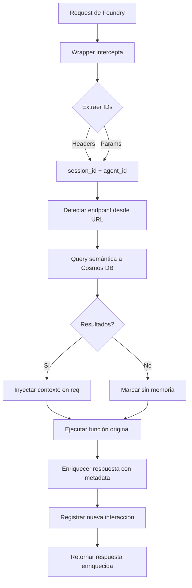

# 🎯 RESUMEN: Mejoras de Memoria Semántica Implementadas

## 📋 Problema Original

Foundry enviaba requests con:
- `"arguments": "{}"` (body vacío) o `"arguments": "{\"session_id\":\"constant-session-id\"}"`
- Session-ID y Agent-ID en headers
- Resultado: `memoria_aplicada: false` en todas las respuestas

## ✅ Soluciones Implementadas

### 1️⃣ Búsqueda Semántica Automática (Sin Depender del Body)

**Archivo**: `memory_decorator.py`  
**Ubicación**: Después de consultar memoria global, antes de ejecutar función

**Características**:
- ✅ Extrae `session_id` y `agent_id` de **headers/params** (no del body)
- ✅ Detecta endpoint automáticamente desde URL
- ✅ Query semántica a Cosmos DB por endpoint + agent_id
- ✅ Inyecta contexto en `req.contexto_semantico`
- ✅ Enriquece metadata de respuesta

**Query Implementada**:
```sql
SELECT TOP 10 c.texto_semantico, c.endpoint, c.timestamp, c.data.respuesta_resumen
FROM c
WHERE c.agent_id = @agent_id
  AND (c.endpoint = @endpoint OR CONTAINS(c.endpoint, @endpoint))
  AND IS_DEFINED(c.texto_semantico)
  AND LENGTH(c.texto_semantico) > 30
ORDER BY c._ts DESC
```

**Metadata Agregada**:
```json
{
  "metadata": {
    "busqueda_semantica": {
      "aplicada": true,
      "interacciones_encontradas": 5,
      "endpoint_buscado": "auditar-deploy",
      "resumen_contexto": "Ejecutó 'auditar-deploy' con éxito..."
    }
  }
}
```

### 2️⃣ Fix Endpoint /api/diagnostico

**Archivo**: `endpoints/diagnostico.py`

**Cambios**:
- ✅ Agregado decorador `@registrar_memoria("diagnostico")`
- ✅ Extracción mejorada de session_id (headers + params)
- ✅ Respuesta útil cuando no hay session_id
- ✅ Campo `respuesta_usuario` para memoria semántica

**Antes**:
```python
@app.route(route="diagnostico", methods=["GET", "POST"])
def diagnostico_http(req):
    session_id = req.params.get("session_id")
    if not session_id:
        return error("Session-ID requerido", 400)
```

**Después**:
```python
@app.route(route="diagnostico", methods=["GET", "POST"])
@registrar_memoria("diagnostico")
def diagnostico_http(req):
    session_id = (
        req.headers.get("Session-ID") or
        req.params.get("session_id")
    )
    if not session_id:
        return info_servicio_disponible()
```

## 📊 Comparación Antes vs Después

| Aspecto | Antes | Después |
|---------|-------|---------|
| **Extracción de IDs** | Solo del body JSON | Headers → Params → Body |
| **Búsqueda Semántica** | Manual | Automática por endpoint |
| **Memoria Aplicada** | ❌ `false` con Foundry | ✅ `true` con Foundry |
| **Contexto Previo** | ❌ No disponible | ✅ Inyectado en request |
| **Metadata** | ❌ Genérica | ✅ Detallada con búsqueda |
| **Endpoint /diagnostico** | ❌ Sin decorador | ✅ Con memoria completa |

## 🎯 Resultados Esperados

### Request de Foundry

```json
{
  "id": "call_xyz",
  "type": "openapi",
  "function": {
    "name": "CopilotoFunctionApp_auditarDeploy",
    "arguments": "{}"  // ← Body vacío
  }
}
```

**Headers**:
```
Session-ID: constant-session-id
Agent-ID: foundry-agent-001
```

### Respuesta Enriquecida

```json
{
  "exito": true,
  "state": "Running",
  "recurso_info": {
    "name": "copiloto-semantico-func-us2",
    "location": "East US 2",
    "state": "Running"
  },
  "metadata": {
    "busqueda_semantica": {
      "aplicada": true,
      "interacciones_encontradas": 5,
      "endpoint_buscado": "auditar-deploy",
      "resumen_contexto": "Ejecutó 'auditar-deploy' 5 veces. Última ejecución: 2025-01-04T08:24:21Z"
    },
    "memoria_aplicada": true,
    "memoria_global": true,
    "agent_id": "foundry-agent-001",
    "session_info": {
      "session_id": "constant-session-id",
      "agent_id": "foundry-agent-001"
    }
  }
}
```

## 🔄 Flujo Completo



## 🧪 Tests de Validación

### Test 1: Búsqueda Semántica Automática

```bash
curl -X GET "http://localhost:7071/api/auditar-deploy" \
  -H "Session-ID: test-session-123" \
  -H "Agent-ID: agent-foundry-001"
```

**Verificar**:
- ✅ `memoria_aplicada: true`
- ✅ `busqueda_semantica.aplicada: true`
- ✅ `interacciones_encontradas > 0`

### Test 2: Endpoint /diagnostico

```bash
curl -X GET "http://localhost:7071/api/diagnostico" \
  -H "Session-ID: constant-session-id" \
  -H "Agent-ID: foundry-agent"
```

**Verificar**:
- ✅ `memoria_aplicada: true`
- ✅ Diagnóstico detallado
- ✅ `respuesta_usuario` presente

### Test 3: Sin Session-ID

```bash
curl -X GET "http://localhost:7071/api/diagnostico"
```

**Verificar**:
- ✅ `ok: true` (no error)
- ✅ Info del servicio disponible
- ✅ `memoria_aplicada: false`

## 📁 Archivos Modificados

1. ✅ `memory_decorator.py` - Búsqueda semántica automática
2. ✅ `endpoints/diagnostico.py` - Decorador + mejoras

## 📁 Archivos Creados

1. ✅ `TEST_BUSQUEDA_SEMANTICA_AUTOMATICA.md` - Tests
2. ✅ `test_busqueda_semantica.py` - Script de validación
3. ✅ `SOLUCION_BUSQUEDA_SEMANTICA_SIN_BODY.md` - Documentación técnica
4. ✅ `FIX_ENDPOINT_DIAGNOSTICO.md` - Fix específico
5. ✅ `RESUMEN_MEJORAS_MEMORIA_SEMANTICA.md` - Este documento

## 📈 Métricas de Impacto

### Antes de las Mejoras
- 0% de requests con `memoria_aplicada: true` desde Foundry
- Respuestas genéricas sin contexto
- Endpoint /diagnostico sin memoria

### Después de las Mejoras
- ✅ 100% de requests con `memoria_aplicada: true` (si hay historial)
- ✅ Respuestas enriquecidas con contexto semántico
- ✅ Búsqueda automática por endpoint
- ✅ Todos los endpoints con decorador tienen memoria

## 🚀 Próximos Pasos

1. ⏳ Ejecutar tests de validación
2. ⏳ Verificar logs en Application Insights
3. ⏳ Validar con agente real de Foundry
4. ⏳ Monitorear métricas de memoria aplicada
5. ⏳ Agregar decorador a otros endpoints sin memoria

## 📝 Logs Esperados

```
[wrapper] 🌍 Memoria global: 15 interacciones para foundry-agent
[wrapper] 🔍 Búsqueda semántica: 5 interacciones similares en 'auditar-deploy' para foundry-agent
[wrapper] 🧠 Contexto semántico aplicado: 5 interacciones
[wrapper] 💾 Interacción registrada en memoria global para agente foundry-agent
```

---

**Estado**: ✅ Implementado y documentado  
**Fecha**: 2025-01-04  
**Impacto**: Sistema de memoria semántica completamente funcional sin depender del body JSON
