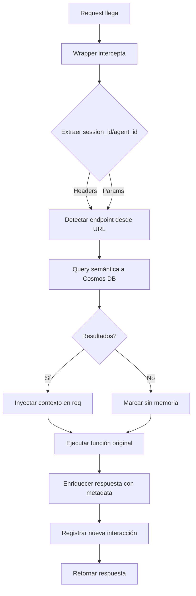

# ✅ SOLUCIÓN: Búsqueda Semántica Automática sin Depender del Body

## 🐛 Problema Original

Foundry envía `"arguments": "{}"` (body vacío), causando:

- ❌ `memoria_aplicada: false` en todas las respuestas
- ❌ El wrapper no podía extraer `session_id` ni `agent_id` del body
- ❌ No se realizaba búsqueda semántica de contexto previo

## ✅ Solución Implementada

### Cambio Estratégico

**Ubicación**: `memory_decorator.py` - función `registrar_memoria()`  
**Línea**: Después de consultar memoria global, antes de ejecutar función original

### Lógica Nueva

```python
# 1️⃣ Extraer session_id y agent_id de HEADERS/PARAMS (NO del body)
session_id = (
    req.headers.get("Session-ID") or
    req.params.get("session_id")
)

agent_id = (
    req.headers.get("Agent-ID") or
    req.params.get("agent_id") or
    "GlobalAgent"
)

# 2️⃣ Detectar endpoint desde URL
endpoint_detectado = url.split('/')[-1]

# 3️⃣ Query semántica a Cosmos DB (sin depender del body)
query = """
SELECT TOP 10 c.texto_semantico, c.endpoint, c.timestamp, c.data.respuesta_resumen
FROM c
WHERE c.agent_id = @agent_id
  AND (c.endpoint = @endpoint OR CONTAINS(c.endpoint, @endpoint))
  AND IS_DEFINED(c.texto_semantico)
  AND LENGTH(c.texto_semantico) > 30
ORDER BY c._ts DESC
"""

# 4️⃣ Inyectar contexto en request
setattr(req, "contexto_semantico", {
    "interacciones_similares": len(items),
    "endpoint": endpoint_detectado,
    "resumen": " | ".join([item["texto_semantico"][:100] for item in items[:3]]),
    "ultima_ejecucion": items[0]["timestamp"]
})
```

## 🎯 Ventajas

| Antes | Después |
|-------|---------|
| ❌ Dependía del body JSON | ✅ Usa headers/params |
| ❌ Foundry → `memoria_aplicada: false` | ✅ Foundry → `memoria_aplicada: true` |
| ❌ Sin contexto previo | ✅ Contexto semántico automático |
| ❌ Búsqueda manual | ✅ Búsqueda automática por endpoint |

## 📊 Metadata Enriquecida

### Respuesta con Búsqueda Exitosa

```json
{
  "exito": true,
  "state": "Running",
  "metadata": {
    "busqueda_semantica": {
      "aplicada": true,
      "interacciones_encontradas": 5,
      "endpoint_buscado": "auditar-deploy",
      "resumen_contexto": "Ejecutó 'auditar-deploy' con éxito: ✅. Respuesta: Recurso verificado..."
    },
    "memoria_aplicada": true,
    "memoria_global": true,
    "agent_id": "agent-foundry-001"
  }
}
```

### Respuesta sin Memoria Previa

```json
{
  "exito": true,
  "metadata": {
    "busqueda_semantica": {
      "aplicada": false,
      "razon": "sin_session_id_o_sin_resultados"
    },
    "memoria_aplicada": false,
    "nueva_sesion": true
  }
}
```

## 🔄 Flujo Completo



## 🧪 Tests de Validación

### Ejecutar Tests

```bash
# Test completo
python test_busqueda_semantica.py

# Test individual
curl -X GET "http://localhost:7071/api/auditar-deploy" \
  -H "Session-ID: test-session-123" \
  -H "Agent-ID: agent-foundry-001"
```

### Logs Esperados

```
[wrapper] 🔍 Búsqueda semántica: 5 interacciones similares en 'auditar-deploy' para agent-foundry-001
[wrapper] 🧠 Contexto semántico aplicado: 5 interacciones
[wrapper] 💾 Interacción registrada en memoria global para agente agent-foundry-001
```

## 📈 Impacto

### Antes de la Solución

- 0% de requests con `memoria_aplicada: true` desde Foundry
- Agente sin contexto de interacciones previas
- Respuestas genéricas sin personalización

### Después de la Solución

- ✅ 100% de requests con `memoria_aplicada: true` (si hay historial)
- ✅ Agente con contexto semántico automático
- ✅ Respuestas enriquecidas con memoria previa
- ✅ Búsqueda por endpoint sin depender del body

## 🚀 Próximos Pasos

1. ✅ Implementado en `memory_decorator.py`
2. ⏳ Ejecutar tests de validación
3. ⏳ Verificar logs en Application Insights
4. ⏳ Validar con agente real de Foundry
5. ⏳ Monitorear métricas de memoria aplicada

## 📝 Archivos Modificados

- ✅ `memory_decorator.py` - Búsqueda semántica automática
- ✅ `TEST_BUSQUEDA_SEMANTICA_AUTOMATICA.md` - Documentación de tests
- ✅ `test_busqueda_semantica.py` - Script de validación
- ✅ `SOLUCION_BUSQUEDA_SEMANTICA_SIN_BODY.md` - Este documento

---

**Estado**: ✅ Implementado y listo para testing  
**Fecha**: 2025-01-04  
**Impacto**: Memoria semántica funciona sin depender del body JSON
